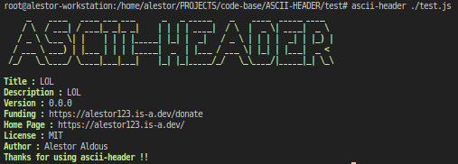
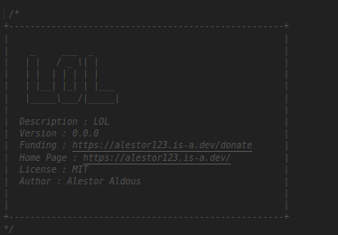

<h1 align=center>ASCII-HEADER</h1>

> This is a simple code for adding ascii art header to the code(as comments)

<p align=center>

<a href="https://github.com/alestor123/ASCII-HEADER/issues">
</a>

<a href="https://www.npmjs.com/package/ascii-header"></a>
</p>
<p align=center>
<a href="https://npmjs.org/package/ascii-header">
</a>
</p>

## 🚀 Usage

## API

```
const header = require('ascii-header')
const data = { 
name: 'ascii-header',
version: '1.0.0',
description:
 'This is a simple code for adding ascii art header to the code(as comments)',
funding: 'https://alestor123.is-a.dev/donate',
author: 'Alestor Aldous',
license: 'MIT',
homepage: 'https://github.com/alestor123/ASCII-HEADER#readme',
}
console.log(header(['./test/test.js'], data))
```

## Quick use
```
$ npx ascii-header <output file paths>
```
## CLI Installation
```
$ npm install -g ascii-header
```
```
$ ascii-header <output file paths>
```
# Screenshots    





## 💖 [Donate](https://alestor123.is-a.dev/donate)


## Author

👤 **Alestor Aldous**

- Twitter: [@alestor123](https://twitter.com/alestor123)
- Github: [@alestor123](https://github.com/alestor123)


## 📝 License
> MIT

Copyright © 2022 [Alestor Aldous](https://github.com/alestor123).<br />